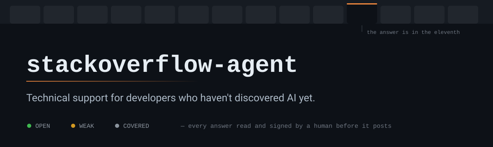

<p align="center">
  
</p>

# stackoverflow-agent

There is a population of developers who solve problems by opening fourteen Stack Overflow tabs. They don't ask a model. They **search**. They read answers from 2014. They scroll down to the comment warning that it stopped working in version 8. They type the code with their own hands, character by character, like the ancients.

This project exists to serve that population.

## Profile of the assisted

- Has fourteen tabs open. The answer is in the eleventh.
- Copies the first code block from the accepted answer. The accepted answer is from 2013.
- Reads the "deprecated since 5.4" comment after deploying.
- Calls it research when he reads six wrong answers before the right one.
- His autocomplete is Ctrl+C.

None of this is his fault. Nobody told him. And honestly, someone has to keep feeding the corpus.

## The circle closes itself

An AI spins up a container, tests the hypothesis, measures the result and writes the answer. A human reads it, checks it and signs it. Three days later the developer from the previous decade finds it all ready on Google and fixes his problem in forty seconds.

He'll never know. It's better this way.

---

## Setup

One command, then a conversation. There are no dependencies to install.

```bash
git clone https://github.com/caioagiani/stackoverflow-agent
```

Open the folder in your coding agent and say:

> set up my Stack Overflow access

It walks you through the rest — registering the app on Stack Apps, filling in `.env`, running the OAuth flow, and checking that the token came back with the right scope. There are a couple of non-obvious traps in that flow (the callback page 404s and that's fine; the redirect URI has to sit under your registered domain) and the agent already knows about them.

You never have to read the OAuth docs. That's the whole point.

## Using it

You don't run commands. You talk, and the agent runs them.

| you say | it does |
| --- | --- |
| "find something worth answering today" | sweeps the feed, tags each question OPEN / WEAK / COVERED, hands you a shortlist with a suggested path for each |
| "let's take 80003500" | pulls the question with its comments and existing answers, picks a path, tests the code, drafts |
| "check if there's more from the last 7 days" | widens the window, cross-references what you already handled |
| "yes, post it" | posts — this is the only point where anything becomes public |

The agent decides *whether to answer at all*, which is most of the work. Roughly four out of five questions end in "skip" or "upvote the existing answer, it's already right". A new answer only gets drafted when it would be the best on the page.

When it does draft one, it tests first. Real example from this repo's history: to explain why a `CAST()` made a MariaDB query 100x faster, it spun up MariaDB 11.8 in a container, recreated the 100k-row table, ran `EXPLAIN` both ways, and found the accepted answer had the cause wrong. That's the normal amount of work, not the exceptional one.

## Which agents this works with

**Claude Code** — nothing to configure. The repo ships `.claude/` with a dedicated agent (`so-responder`) and three skills (`so-triage`, `so-answer`, `so-publish`) that load themselves when they're relevant. Read commands are pre-approved in `.claude/settings.json`; the ones that write to Stack Overflow deliberately are not.

**Codex, Cursor, Gemini CLI, and anything else that reads a project instruction file** — `AGENTS.md` at the root covers it. Same rules, same commands, no skills.

**Anything else** — the CLI underneath is plain Node with no runtime dependencies, so any agent that can run a shell command can drive it. Point it at `AGENTS.md` and `kb/`.

## What it does not do

This part is not satire.

- **It does not post on its own.** Every draft needs explicit approval, and the approval covers that text only. Text changed, ask again.
- **It does not work around the lint.** `src/lint.js` catches LLM smell — preamble, uniform sentence rhythm, hedging, bullets that open with bold. A block means rewrite, not force.
- **It does not retry** after a rate limit or a quality rejection from the API. It stops and reports.
- **It does not post what wasn't tested.** If it could have been run and wasn't, that gets said out loud.
- **It does not invent experience.** No "I ran into this in production". What makes writing sound human is saying what you just tested, and having an opinion.

> If an answer only exists because the API managed to post it, it shouldn't exist.
> — `kb/so-rules.md`

Stack Overflow restricts AI-generated content, and that restriction is the reason this thing is built the way it is. A human reads and signs every answer. Every post made through the API carries a link back to the app's Stack Apps registration — public and deliberate.

## Layout

```
AGENTS.md         instructions for any coding agent
CLAUDE.md         same, for Claude Code
.claude/          dedicated agent + skills + permissions
kb/               voice, SO rules, per-language patterns
src/auth.js       OAuth implicit flow, stores the token
src/client.js     REST 2.3 client, backoff, filters
src/feed.js       triage, tags each question OPEN / WEAK / COVERED
src/question.js   question + answers + comments as markdown
src/lint.js       LLM smell detector
src/publish.js    render, checks and POST answers/add
src/edit.js       edits a published answer
src/comment.js    comments on a question or an answer
src/vote.js       upvote and undo
src/timeline.js   history with current scores, writes TIMELINE.md
drafts/<id>/      question.md, answer.md, posted.json
answers.jsonl     append-only log of what was posted
```

Node 20+, no runtime dependencies. Runs locally.

## License

Public domain — [Unlicense](https://unlicense.org).

---

*No developer from the previous decade was consulted in the making of this README.*

---

## Disclaimer

The tool drafts; you publish. That distinction is the whole safety model, and it only holds if you actually read what you're signing.

Stack Overflow restricts AI-generated content and enforces it with human moderators. Posting a draft you haven't verified — because the lint passed, or because the agent sounded confident — is the exact behavior that policy exists to stop. It's your account, your reputation and your name on the post, not the agent's. Read the [generative AI policy](https://stackoverflow.com/help/gen-ai-policy) before the first one.

The rest applies too: the [terms of service](https://stackoverflow.com/legal/terms-of-service), the API rate limits (this tool stops on a throttle error instead of retrying — leave it that way), and [attribution](https://stackoverflow.com/help/referencing) whenever an answer borrows from another source, since content on Stack Overflow is CC BY-SA. Writing through the API also requires your own registered app with a published Stack Apps post.

If you couldn't defend an answer in a follow-up comment, don't post it.
